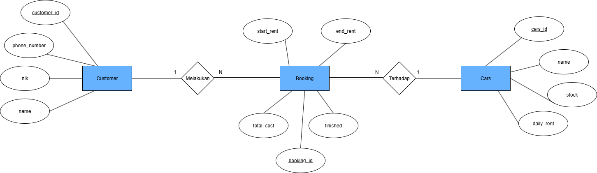
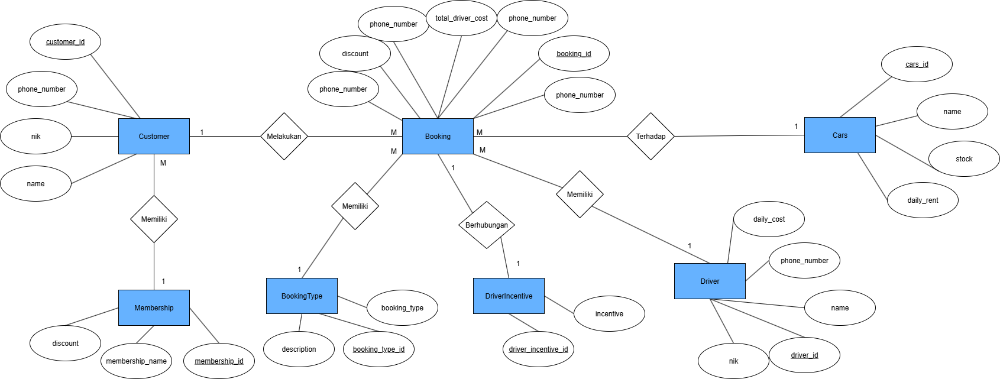

Disini ada dua versi API yaitu v1 dan v2 dimana table dari tiap versi juga terpisah


## ERD dari V1


## ERD dari V2


Link : [ERD V1 & V2](https://drive.google.com/file/d/1FBfhe8KrwiHM_vQ_WQ8EZ82Z5OXFD6Yc/view?usp=sharing)

## Postman

Di folder archive terdapat car-rental.postman, bisa diimport ke postman.

Link: [API V1 & V2](https://web.postman.co/workspace/Testing-API~08f43fd0-7405-42ef-9080-e87473e803df/collection/27782969-aba258ad-f17b-42ae-bf2b-1398711deabe?action=share&source=copy-link&creator=27782969)

## How to Run Code
1. Go to carrental folder
    ```
    cd cmd/carrental
    ```
2. Run the code
    ```
    go run main.go
    ```